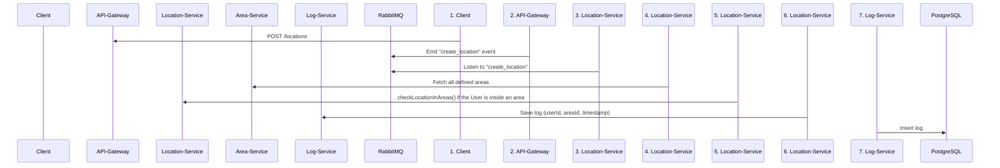

# 📍 Martı Test Case

# 📍 Location Logging System

A distributed, event-driven microservice architecture that logs user location data and detects geofence entry events in real time. Built with NestJS, RabbitMQ, PostgreSQL, TypeORM, Redis, and Docker.

---

## 🧠 Project Overview

**Location Logging System** is designed to collect user location data at regular intervals and determine whether users have entered predefined geographical areas. If a user enters such an area, the system logs this event in the database. The entire system is built with performance, scalability, and real-time data processing in mind.

---

## 📦 Microservices Architecture

| Service           | Description                                                                 |
|-------------------|-----------------------------------------------------------------------------|
| `api-gateway`     | Central API entry point, responsible for routing and validation             |
| `location-service`| Handles incoming location data and publishes events for geofence detection  |
| `area-service`    | Manages geographic area definitions                              |
| `log-service`     | Subscribes to location events and logs user entries into geofenced areas    |

Communication between services is done through **RabbitMQ** in an **event-driven architecture**.

---

## 🚀 Tech Stack

- **Backend Framework:** [NestJS](https://nestjs.com/)
- **Language:** TypeScript
- **Database:** PostgreSQL
- **ORM:** TypeORM
- **Messaging:** RabbitMQ
- **Caching:** Redis
- **Containerization:** Docker

---

## 🔌 API Endpoints

### 📍 Location Service

- `POST /locations`: Accepts user's latitude and longitude with user ID
- `GET /locations`: List all locations

### 📦 Area Service

- `POST /areas`: Create a new geographical area
- `GET /areas`: List all defined areas
- `GET /areas/:id`: Retrieve a specific geographical area by its ID
- `PUT /areas/:id`: Update a specific geographical area by its ID
- `DELETE /areas/:id`: Remove a specific geographical area by its ID


### 📜 Log Service

- `GET /logs`: Get all user-area entry logs by userId and areaId
- `GET /logs/stats`: Get aggregated log statistics filtered by `userId`, `startDate`, and `endDate`. 

---

## 🔄 Event Flow


## Project setup

```bash
$ npm install
```

## Compile and run the project

```bash
# development
$ npm run start

# watch mode
$ npm run start:dev

# production mode
$ npm run start:prod
```

## Run tests

```bash
# e2e tests
$ npm run test:e2e

# test coverage
$ npm run test:cov